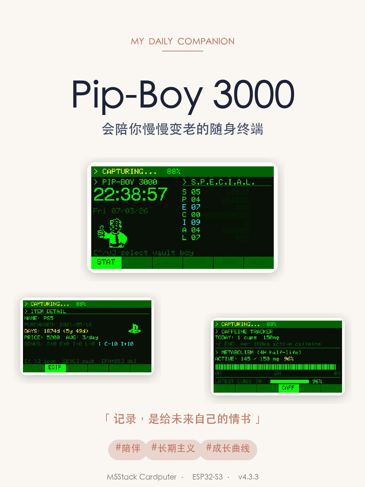
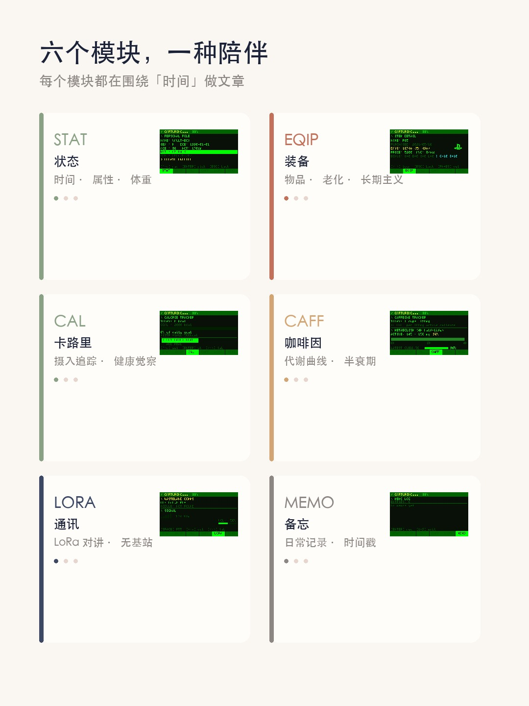
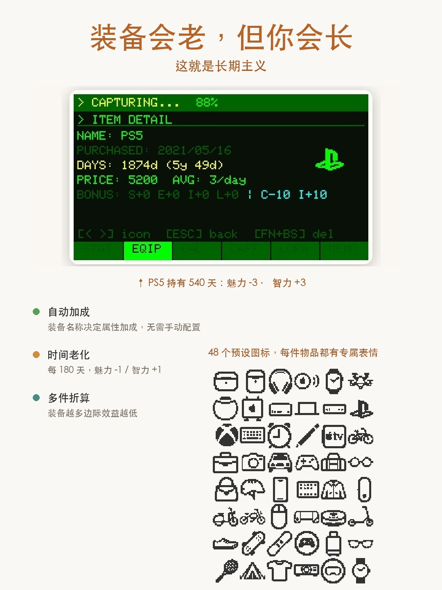
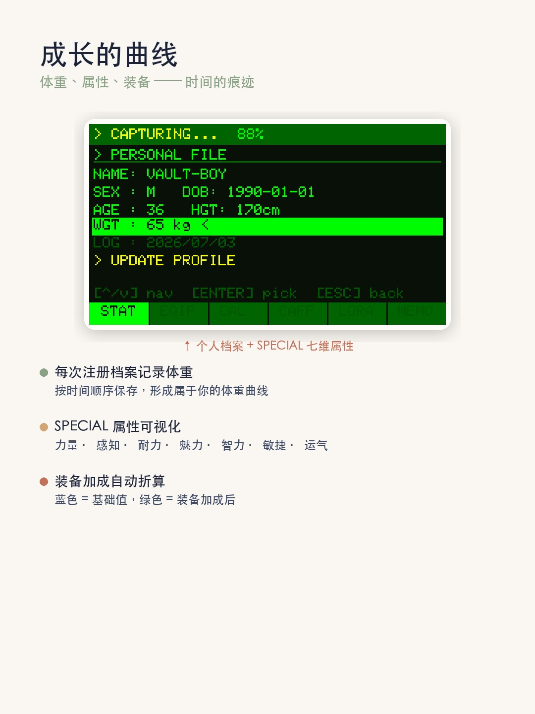
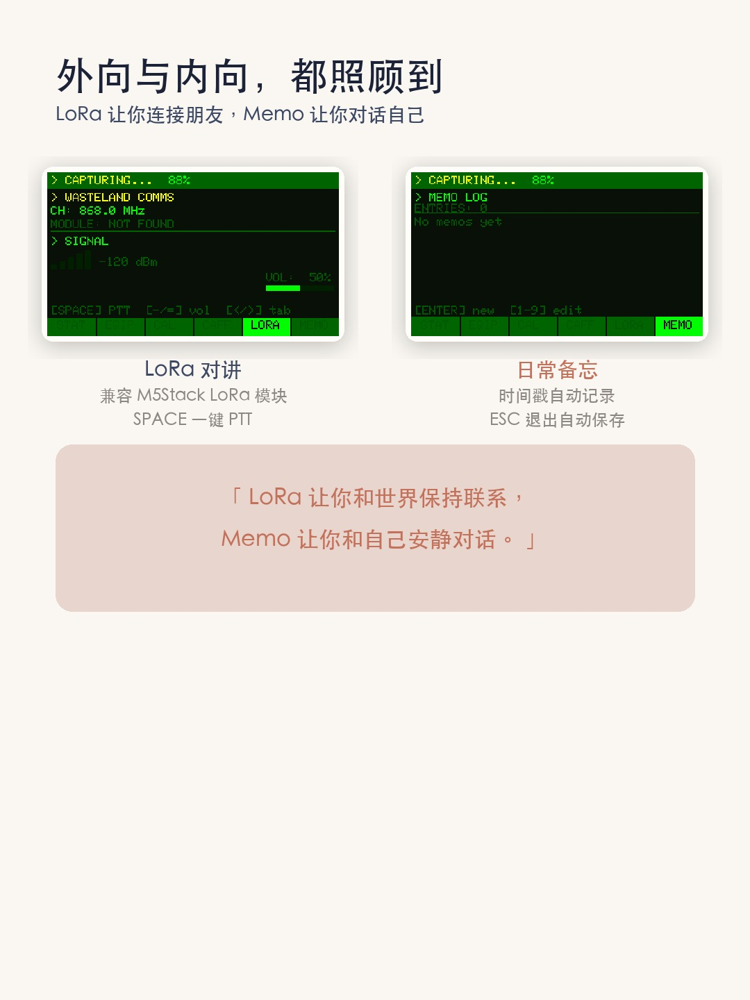
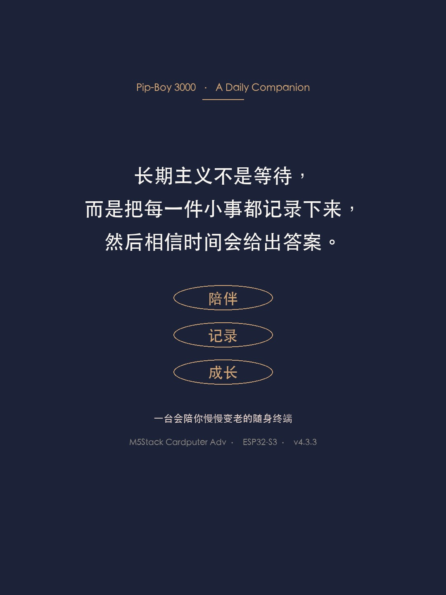

# pipboy-cardputer

> ⚡ Vault-Tec 认证 · 一台会陪你慢慢变老的随身终端

基于 **M5Stack Cardputer Adv** 的微型随身终端系统。1.14 寸屏幕 + 56 键键盘，记录时间、身体、装备与心情。不抢注意力，但永远不会忘记你的记录。



---

## 🧭 六个模块，一种陪伴

### STAT · 状态 📊
时间、日期、电量 + **S.P.E.C.I.A.L. 七维属性**可视化。注册档案即记录体重，按时间保存，形成你的体重成长曲线。

### DATA · 数据 📁
集中查看所有历史记录——档案、装备、备忘、截图。

### RADIO · 无线 📡
兼容 **M5Stack LoRa 模块**，无需基站、无需手机信号。按下 SPACE 就是 PTT，和朋友在野外、展会、地下室保持联系。

### INV · 装备 🎒
**装备不是道具，是时间的载体。**
- 装备名称自动决定属性加成（哈希算法，无需手动配置）
- 每 180 天，魅力 -1 / 智力 +1——用久了更懂它，但新鲜感没了
- 48 个预设图标可选，支持价格记录与日均成本计算
- 装备越多边际效益越低，鼓励精挑细选

### EQIP · 健康 ☕
- **CAL 卡路里追踪**：随手一记，培养对食物的觉察
- **CAFF 咖啡因代谢**：5 档快捷剂量（50/80/100/150/200mg），5 小时半衰期血药浓度曲线，让你知道「今晚还能不能睡」

### SNAP · 备忘 📝
56 键全键盘输入，Fn 组合键输入符号，时间戳自动记录。ESC 退出即自动保存，支持导出到 SD 卡。



---

## 🌱 长期主义

装备会老化，咖啡因会代谢，体重会波动。所有模块都在围绕「时间」做文章——

**今天的一个小记录，是十年后的一组曲线。**



---

## 🔧 硬件规格

| 项目 | 参数 |
|------|------|
| 平台 | M5Stack Cardputer Adv |
| MCU | ESP32-S3 双核 240MHz (FN8, 8MB Flash) |
| 屏幕 | ST7789 1.14" 240×135 |
| 输入 | 56 键 QWERTY 键盘 + G0 功能键 |
| 存储 | NVS（闪存持久化）+ microSD（截图导出） |
| 扩展 | Grove I2C / LoRa 模块兼容 |

---

## 🚀 快速开始

### 浏览器一键烧录

无需安装任何软件，Chrome 或 Edge 浏览器即可完成烧录。

1. 打开烧录页面：**https://yuuuna3595.github.io/pipboy-cardputer/**
2. 插上 USB-C 线连接 Cardputer
3. 点击 **CONNECT** → 在弹窗中选择串口设备
4. 点击 **INSTALL** → 等待进度条走完 → 拔线重启

> ⚠️ 仅支持 Chrome / Edge（需 Web Serial API）。首次使用需在浏览器弹窗中选择串口设备并授权。

### 首次启动

设备启动后进入引导菜单，可通过 WiFi 连接互联网同步 NTP 时间，也可选择离线模式本地使用。

---

## ⌨️ 按键操作

| 按键 | 功能 |
|------|------|
| Tab | 切换 6 大模块 |
| G0 (左下角) | 返回主菜单 / 全局截图 (Ctrl+S) |
| Enter | 确认 / 进入明细 |
| `;` / `.` | 上下导航 |
| n | 装备模块：新增装备 |
| Esc | 退出子菜单 / 备忘录自动保存 |

---

## 🖼️ 展示







---

## 📂 项目结构

```
pipboy-cardputer/
├── .gitignore
├── LICENSE               # MIT
├── README.md
├── index.html            # 浏览器烧录页面 (ESP Web Tools)
├── firmware/             # 预编译固件
│   ├── manifest.json     # ESP Web Tools 烧录清单
│   ├── pipboy_cardputer_v1_0.ino.bin          # 主程序
│   ├── pipboy_cardputer_v1_0.ino.bootloader.bin
│   ├── pipboy_cardputer_v1_0.ino.partitions.bin
│   └── boot_app0.bin
└── images/               # 展示图片素材
    ├── 01_cover.jpg
    ├── 02_intro.jpg
    ├── 03_modules.jpg
    ├── 04_longterm.jpg
    ├── 05_health.jpg
    ├── 06_growth.jpg
    ├── 07_connect.jpg
    └── 08_ending.jpg
```

---

## 📝 许可

本项目采用 [MIT License](LICENSE) 开源。

---

*一台会陪你慢慢变老的随身终端。记录，是给未来自己的情书。*
